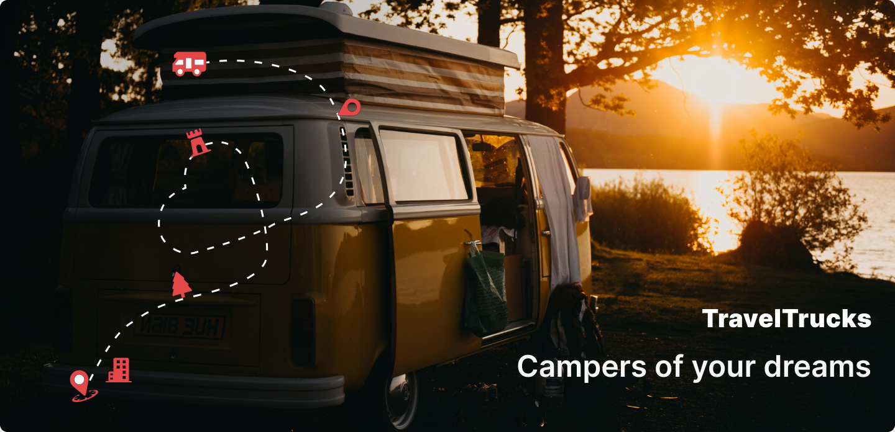
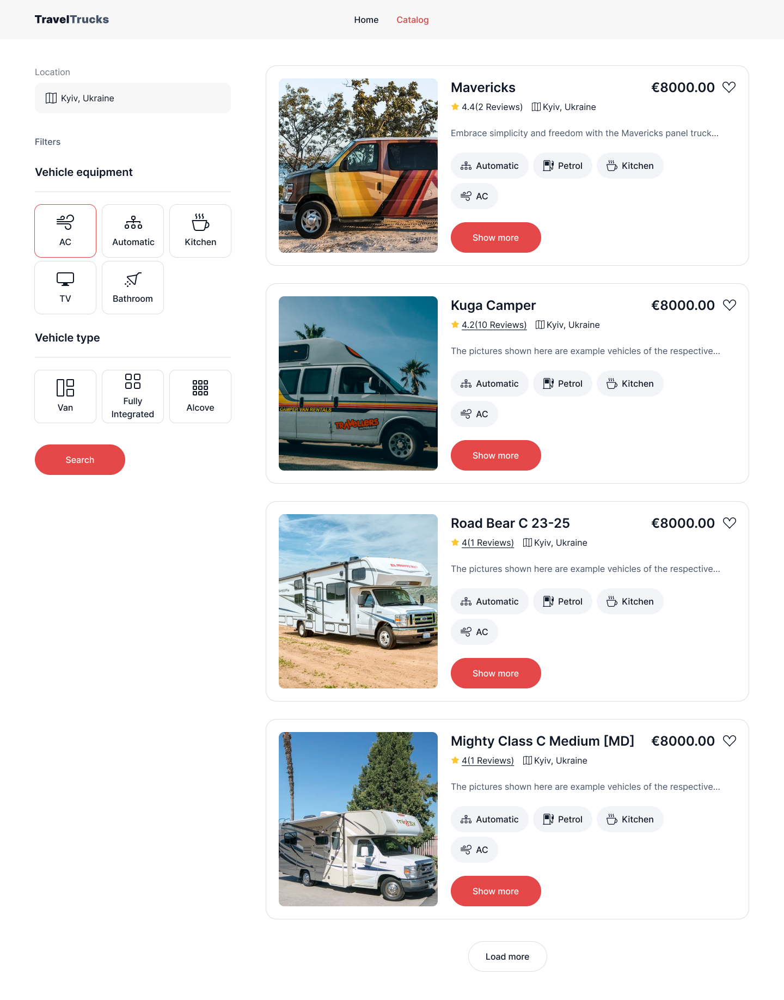
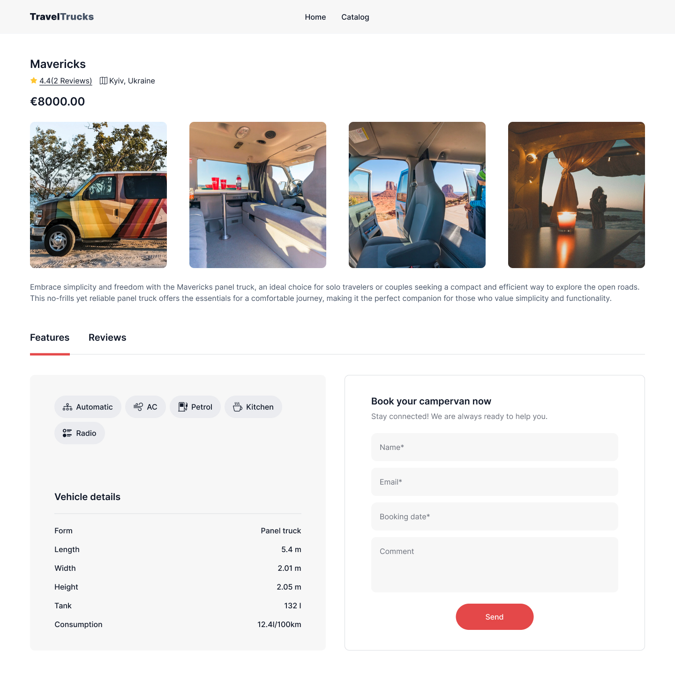
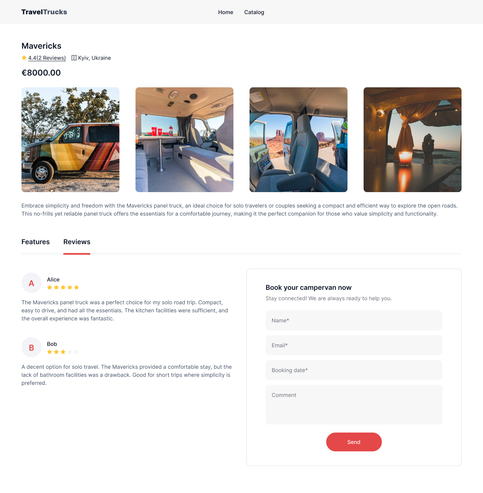

# Travel Trucks Rental App

<a href="https://travel-trucks-rental.vercel.app/" target="_blank">
  
</a>

<h4 align="center">
More than just camper rentals — adventure awaits
</h4>

### Project description

The TravelTrucks web application allows users to rent campers for their adventures.

The application provides a user-friendly interface to browse, filter, and book campers, enhancing the rental experience with detailed camper information, user reviews, and a easy booking process.

### Features

The web application includes several pages, such as the home page, catalog page, and a detailed camper info page with reviews and a booking form.

<div class="text-img-block">
  
  <h5>Vehicles catalog</h5>
  <p>
  The web application includes several pages, such as the home page, catalog page, and a detailed camper info page with reviews and a booking form. The web application includes several pages, such as the home page, catalog page, and a detailed camper info page with reviews and a booking form. The web application includes several pages, such as the home page, catalog page, and a detailed camper info page with reviews and a booking form. The web application includes several pages, such as the home page, catalog page, and a detailed camper info page with reviews and a booking form.
  </p>
</div>

<div class="text-img-block">
  
  <h5>Camper details page with specs</h5>
  <p>
  Some text Some text Some text Some text Some text Some text Some text Some text Some text Some text Some text Some text Some text Some text Some text Some text Some text Some text Some text Some text Some text Some text Some text Some text Some text Some text Some text Some text Some text Some text Some text Some text Some text Some text Some text Some text Some text Some text Some text Some text Some text Some text Some text Some text Some text Some text Some text Some text Some text 
  </p>
</div>

<div class="text-img-block">
  
  <h5>Customer reviews</h5>
  <p>
  Some text Some text Some text Some text Some text Some text Some text Some text Some text Some text Some text Some text Some text Some text Some text Some text Some text Some text Some text Some text Some text Some text Some text Some text Some text Some text Some text Some text Some text Some text Some text Some text Some text Some text Some text Some text Some text Some text Some text 
  </p>
</div>

<div class="text-img-block">
  
  <h5>Request your favorite vehicle rent</h5>
  <p>
  Some text Some text Some text Some text Some text Some text Some text Some text Some text Some text Some text Some text Some text Some text Some text Some text Some text Some text Some text Some text Some text Some text Some text Some text Some text Some text Some text Some text Some text Some text Some text Some text Some text Some text Some text Some text Some text Some text Some text Some text Some text Some text Some text Some text Some text Some text Some text Some text Some text 
  </p>
</div>

<div class="text-img-block">
  
  <h5>Favorites</h5>
  <p>
  Mark your favorite vehicles.
  </p>
</div>

### Technologies Used

* **Frontend**: React, Redux, React Router, Axios
* **Styling**: CSS Modules / styled-components / MUI (choose the one you used)
* **Build Tool**: Vite
* **Backend**: MockAPI (for testing purposes)

### Installation

1. Clone the repository:
    ```sh
    git clone https://github.com/oleksandr-romashko/travel-trucks.git
    cd traveltrucks
    ```
1. Install dependencies:
   using _npm_:
    ```sh
    npm install
    ```
    or using _yarn_:
    ```sh
    yarn
    ```
1. Start the development server:
    using _npm_:
    ```sh
    npm run dev
    ```
    or using _yarn_:
    ```sh
    yarn dev
    ```

### API Endpoints

Use the following endpoints to interact with the backend API:

* *GET /campers*: Retrieve all camper listings. Filters can be added as parameters.
* *GET /campers/*: Retrieve details of a specific camper by its ID.

API Base URL: https://66b1f8e71ca8ad33d4f5f63e.mockapi.io/campers

### Contributing

Contributions are welcome! Follow these steps to contribute:

1. Fork the repository.
2. Create a new branch (`git checkout -b feature-branch`).
3. Make your changes.
4. Commit your changes (`git commit -m 'Add new feature'`).
5. Push to the branch (`git push origin feature-branch`).
6. Open a pull request.

### License

This project is licensed under the MIT License - see the LICENSE file for details.

### Contact Information

For any inquiries, please contact:

Name: Your Name
Email: your.email@example.com
GitHub: yourusername


#### Ma

To implement the functionality for working with camper listings in your frontend application, use the ready-made backend API available at: https://66b1f8e71ca8ad33d4f5f63e.mockapi.io/campers

**Live page:** [on Vercel](https://travel-trucks-rental.vercel.app/)

**How to run:**

#### Main endpoints:

GET /campers to get all listings (filters can be added as parameters)
GET /campers/
to get listing details by its ID
Project Requirements:

### 1. Framework and Libraries:

Work is done using Vite bundler with React.
Redux for state management.
React Router for routing.
Axios library for requests.
Any CSS library of your choice (e.g., CSS modules, styled-components, MUI, etc.).

### 2. Main Pages:

Home Page: Should include a banner with a primary call to action.
Catalog: Page displaying all available vehicles with the ability to filter by specific criteria (location, vehicle type, presence of AC, kitchen, etc.) and the ability to add a camper to favorites.
Camper Details Page: Page with detailed description of the selected camper, photo gallery, user reviews, and a booking form. Use the following properties to describe features if present on the camper: transmission, engine, AC, bathroom, kitchen, TV, radio, refrigerator, microwave, gas, water. Use the following properties for details: form, length, width, height, tank, consumption.

### 3. Routing:

/ - Home Page
/catalog - Catalog Page
/catalog/
- Camper Details Page

### 4. Application State:

Use Redux for state management.
Create a global state to store the list of vehicles, filter states, and the list of favorites.
When sending a request for filtered vehicles, it is important to reset previous search results to ensure the relevance and accuracy of the data displayed according to new filter criteria.

### 5. Functional Requirements:

Navigation to Catalog Page: Users should be able to click "View Now" button on the home page to go to the catalog page.
Vehicle Filtering: Users should be able to filter vehicles by:
Location (text field)
Body Type (only one body type can be selected)
Presence of AC, kitchen, and other criteria (multiple criteria can be selected).
Favorites: Users should be able to add vehicles to the favorites list. The list of favorite campers should persist on page reload.
Rental Price: The rental price should be specified as a single value (e.g., 8000). In the UI, it should be displayed with a comma (8000.00).
Navigation to Details Page: Users should be able to click "Show more" button on the vehicle card on the catalog page to open a new browser tab with the detailed description of this vehicle.
Loading More Cards: The catalog page should have a "Load More" button to load additional vehicle cards, considering the selected filters.
Reviews: The camper details page should display user reviews, rating the camper on a five-star scale.
Booking Form: Users should be able to book a camper by filling out the form on the camper details page. A successful form submission should result in a notification about the successful booking.

### 6. Design:

Follow the provided layout.
The layout should be implemented for the desktop version. Responsiveness can be implemented optionally.

### 7. Development:

Use a component-based approach.
Follow the DRY (Don't Repeat Yourself) principle.
Write clean and readable code with comments where necessary.
The project should be deployed (on vercel.com or netlify.com).

### Other Evaluation Criteria for the Completed Technical Task:

Well-structured head of the website.
No errors in the console.
Formatted code.
Valid markup.
No unnecessary files in the repository.
Instructions for running the project described in the README.md file.
All changes committed with clear messages.
Loader present for asynchronous requests.
Correctly functioning routing on the live page on vercel.com/netlify.com.


<style>

.img-thumbnail {
    display:block;
    float:none;
    margin-left:auto;
    margin-right:auto;
    width:77%;
}

.text-img-block {
  display:inline-block;
}

.img-center-align {
    display:block;
    float:none;
    margin-left:auto;
    margin-right:auto;
    width:33%;
}

.img-float-left-align {
    display:inline-block;
    float:left;
    margin-right:16px;
    width:35%;
}

.img-float-right-align {
    display:inline-block;
    float:right;
    margin-left:16px;
    width:35%;
}

</style>
